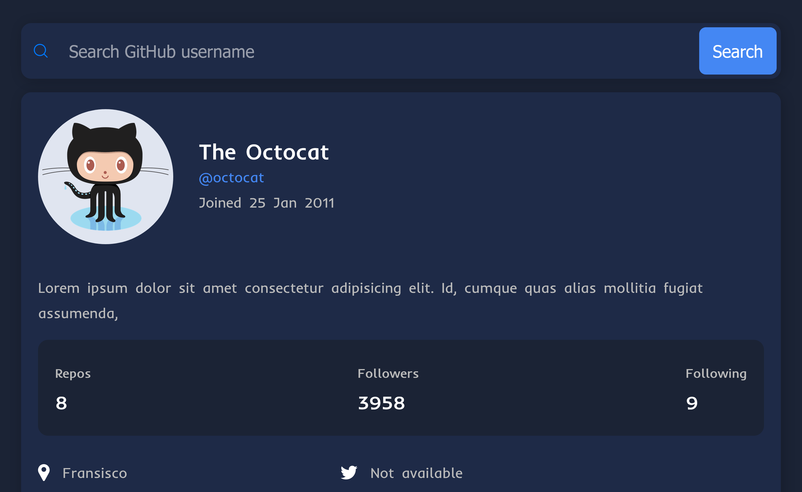

# Frontend Mentor - GitHub user search app solution

This is a solution to the [GitHub user search app challenge on Frontend Mentor]. Frontend Mentor challenges help you improve your coding skills by building realistic projects. 

## Table of contents

- [Overview](#overview)
  - [The challenge](#the-challenge)
  - [Screenshot](#screenshot)
  - [Links](#links)
- [My process](#my-process)
  - [Built with](#built-with)
  - [What I learned](#what-i-learned)
  - [Continued development](#continued-development)
- [Author](#author)
- [Acknowledgments](#acknowledgments)


## Overview

### The challenge

Users should be able to:

- See the size of the elements adjust based on their device's screen size
- See hover state for all interactive elements on the page
- Searxh for GitHub by their username
- See relevant user information based on their search
- Switch between light and dark mode

### Screenshot



### Links

- Solution URL: [Add solution URL here](https://your-solution-url.com)
- Live Site URL: [Add live site URL here](https://your-live-site-url.com)

## My process

### Built with

- Semantic HTML5 markup
- Javascript
- CSS For styles


### What I learned

I Learned about APIs, how to fetch them and convert to a javascript object
using the javascript fetch API method, GitHub API to be precise.

```js
async function nyFile(){
  let x = await fetch()
  let y = await x.json()
}
```

### Continued development

To learn more about APIs

## Author


- Frontend Mentor - [@yourusername](https://www.frontendmentor.io/profile/papilo-cloud)
- Twitter - [@yourusername](https://www.twitter.com/@Abdulra75754192)


## Acknowledgments

Brad Traversy, I'm a big fan
W3School.